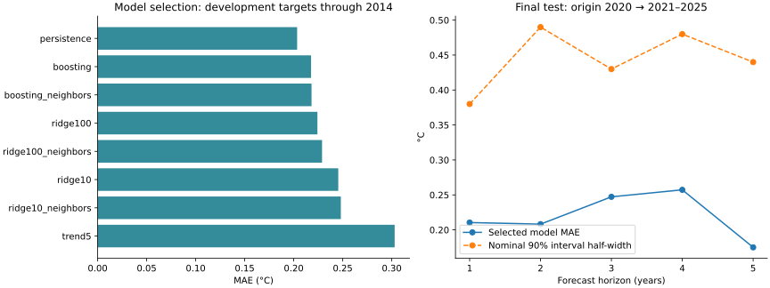
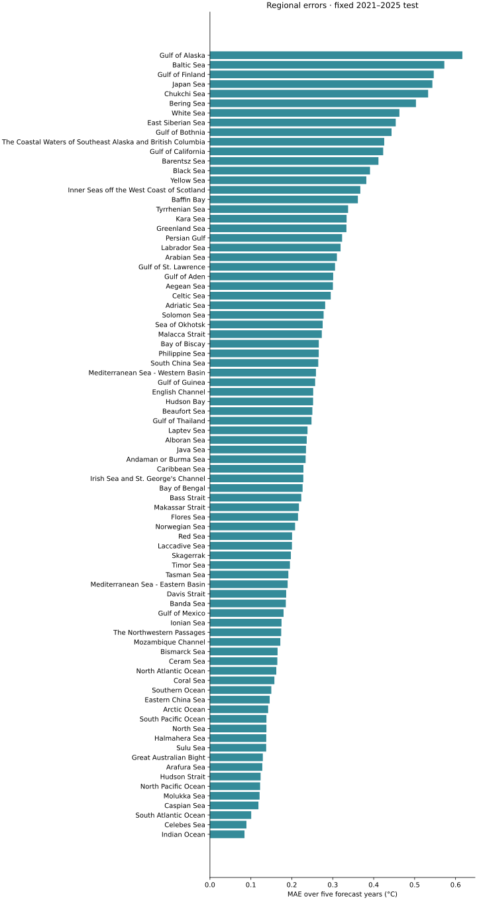

# Forecasting annual regional surface temperature to 2030

## Question and scope

Can historical temperature and geographic features beat simple references when
forecasting a known region one to five years ahead? This is a retrospective
statistical experiment for 2026–2030, not a climate scenario.
The target is annual regional surface temperature in °C, never anomaly or daily
water temperature. Caspian is included as a separate inland region.

There are **22 NOAA-derived series × 44 years = 968 source values**. NOAA ERSSTv6
is a 2° reconstruction, not a collection of direct local measurements. The 80
neighbor-imputed regions are excluded from model labels, features and evaluation.
They receive explicitly derived predictions from their existing NOAA donors,
with no claim of local validation or generalization to unseen regions. Inputs are the versioned
`seaTemperatures.json`, `caspianTemperatures.json` and their polygons; input,
configuration and pipeline SHA-256 hashes identify each run. The historical
snapshot is the present reconstruction, not archived real-time data vintages.

## Reproduce the experiment offline

Use Python 3.12 and the pinned numerical dependencies:

```bash
python -m pip install -e './python[forecast]'
PYTHONPATH=python python -m ocean_pipeline.forecast
PYTHONPATH=python python -m ocean_pipeline.forecast --check
PYTHONPATH=python python -m unittest discover -s python/tests -p test_forecast.py -v
```

The configuration in `experiments/temperature/config.json` fixes candidates,
seed, dates and coverage target. No NOAA downloads are needed. The forecast CI
job rebuilds numeric artifacts and detects drift. Numerical results use six
decimal places for reproducibility; the website displays predictions to 0.1 °C.
Runtime versions are recorded. Single-thread numerical computation and a fixed
seed reduce nondeterminism. Review new input snapshots before retraining.

## Feature contract

Each example is `(region, origin year)`. Five years of history are required:

| Feature | Definition | Latest temperature used |
| --- | --- | --- |
| `temperature_t`, `_t_minus_1`, `_t_minus_2` | Recent annual values | Origin |
| `mean_5y`, `std_5y` | Population mean and standard deviation over t−4…t | Origin |
| `trend_5y_c_per_year` | Least-squares slope over the last five years | Origin |
| `latitude`, longitude sine/cosine | Polygon representative point; proxy for region location | Static |
| `log_area_km2` | log(1 + approximate geodesic polygon area) | Static |
| `origin_since_1982` | Elapsed years; known at forecast time | Origin |
| Region indicators | One indicator for each existing region | Static |
| Optional neighbor features | Inverse-distance weighted temperature and trend of up to three nearest representative points within 5,000 km | Origin |

Geographic proximity is a predictive heuristic, **not a verified water
connection or transport relationship**. Longitude is encoded cyclically.
Caspian has no marine neighbors and is excluded from everyone else's neighbor
features. Surface is the dataset polygon's approximate area, not volume or the
entire named ocean. Neighbor candidates are compared against matching models
without neighbors. Feature correlations do not establish causal climate effects.

Ridge uses scaling fitted on training data only; boosting uses no scaling.
Learned models estimate change from the origin temperature. Five horizon-specific
models share data across the 22 regions. Persistence repeats the origin value;
trend extrapolates the latest five-year slope. No future temperatures, including
neighbor temperatures, are available to any forecast. Features and labels for
training are retained only when `origin + horizon <= training cutoff`.

## Frozen temporal protocol

| Stage | Forecast origins | Targets | Purpose |
| --- | --- | --- | --- |
| Development | 2000–2009 | 2001–2014 | Select one candidate by pooled MAE |
| Interval calibration | 2014–2018 | Only 2015–2019 | Frozen candidate; empirical residual distribution |
| Final test | 2020 | 2021–2025 | Evaluate selected candidate and predeclared references |
| Publication | 2025 | 2026–2030 | Final historical fit / persistence origin |

All regions share date cutoffs; there is no random row split. Region counts are
balanced, so pooled MAE equals a region-balanced average. Development uses
repeated rolling origins and some target years appear at several horizons;
these errors are not independent. Final test results are not used to select a
candidate, add hyperparameters or tune intervals. The model list is small and
explicit. Do not choose the website model by retrospectively comparing final
holdout candidates.

The nominal 90% symmetric interval is computed separately for each horizon
from absolute calibration errors using a conservative finite-sample order
statistic. Calibration has 110/88/66/44/22 regional errors at horizons 1…5; the
five-year interval has **one forecast origin only**. Temporal and spatial
dependence prevent a coverage guarantee. Widths can be non-monotonic because
sample dates and sizes differ. Report achieved final-test coverage and width,
not just the nominal level. Upstream reconstruction uncertainty and unexpected
future climate changes are not fully captured.

## Derived forecasts for the other 80 historical regions

All 102 historical regions appear in the same 1982–2030 timeline. Direct model
forecasts cover the 22 NOAA histories. For an estimated region `r`, retain its
published 2025 baseline and its existing `estimatedFrom` donors `D(r)`:

`forecast(r, h) = estimated(r, 2025) + mean(forecast(d, h) − NOAA(d, 2025), d in D(r))`.

This transfers the donors' predicted change while preserving the historical
latitude adjustment, clipping and stored baseline. With the selected persistence
model, each derived forecast equals its own 2025 estimated value. No estimated
series is fitted as though it were measured, and no additional model or parameter
is selected using the final test.

Lower and upper bounds use the same transfer formula with donor bounds. These
are **donor-derived ranges**, not calibrated local 90% prediction intervals.
The mapping error and upstream imputation uncertainty are unknown; neither
local MAE nor local coverage is assigned to these 80 regions. `forecastBasis`,
`intervalKind` and donor IDs accompany every prediction. The 22 directly
evaluated regions keep their existing model and empirical test metrics.

## Results and deliverables

[REPORT.md](../reports/temperature/REPORT.md) is generated from the experiment,
with development ranking and horizon-specific final metrics. The selected
candidate is **persistence**: it beats the tested Ridge and boosting candidates
on development MAE. For the 22 evaluated NOAA regions, its final MAE is approximately **0.220 °C**; achieved pooled
coverage is approximately **87%**, below the nominal 90%. This is a negative
result for the added complexity, not evidence that oceans will stop warming.
Flat point forecasts in the website intentionally expose this selected baseline.





| Artifact | Content |
| --- | --- |
| `reports/temperature/metrics.json` | Model settings, rankings, errors by horizon/region, interval coverage, source/code hashes and runtime |
| `reports/temperature/backtests.csv` | Every development candidate prediction, calibration and selected final test, actual and error |
| `reports/temperature/features.csv` | Historical feature diagnostics; one-hot region indicators constructed during training |
| `reports/temperature/geography.json` | Region positions, approximate surface and neighbor definitions |
| `reports/temperature/forecast.csv` | 510 predictions, direct/derived origins, donors and bounds |
| `src/data/temperatureForecasts.json` | Website contract, model and evaluation context |
| `notebooks/temperature_forecasting.ipynb` | Executed exploratory analysis and experiment review |

To regenerate report figures and the notebook, install `python[analysis]`, run
`PYTHONPATH=python python -m ocean_pipeline.forecast_analysis`, and execute the
notebook from the repository root with
`PYTHONPATH=python python -m ocean_pipeline.execute_notebook` (IPython execution
without Jupyter sockets), or open it in Jupyter and run all cells. CI executes
the notebook and fails on cell errors. Python models run offline; the browser only
loads the reviewed prediction artifact. The selected persistence model is fully
specified by its formula, cutoff and source snapshot; no opaque pickle is needed.

## Website behavior

One slider covers **1982–2030**, opening at 2025. All 102 regions remain available
at every year; selecting an estimated region never resets it when entering the
future. The complete chart and table always include history and all five forecast
years, with a boundary at 2025, a dashed future line and a selected-year marker.
The year, tooltip, detail, chart and table identify future predictions in place.

The detail panel shows calibrated intervals and regional test errors for direct
NOAA forecasts; derived forecasts show their donors, inherited range and absence
of local validation. A single CSV export includes every historical and future
row, with columns for type, source basis, donors, bounds, uncertainty kind,
model, cutoff and run ID. The nominal-level field is blank for derived ranges.

## Next evidence needed

More monthly/local data, more forecast origins, independent data vintages and
explicit climate drivers could improve the experiment. They would require a
new predeclared evaluation protocol and a fresh untouched test period. The
present five-year forecast should not be used as a verified local climate
projection.

Method references: [scikit-learn lagged-feature forecasting](https://scikit-learn.org/stable/auto_examples/applications/plot_time_series_lagged_features.html),
[rolling-origin evaluation](https://otexts.com/fpp3/tscv.html),
[NOAA ERSST](https://www.ncei.noaa.gov/products/extended-reconstructed-sst).
